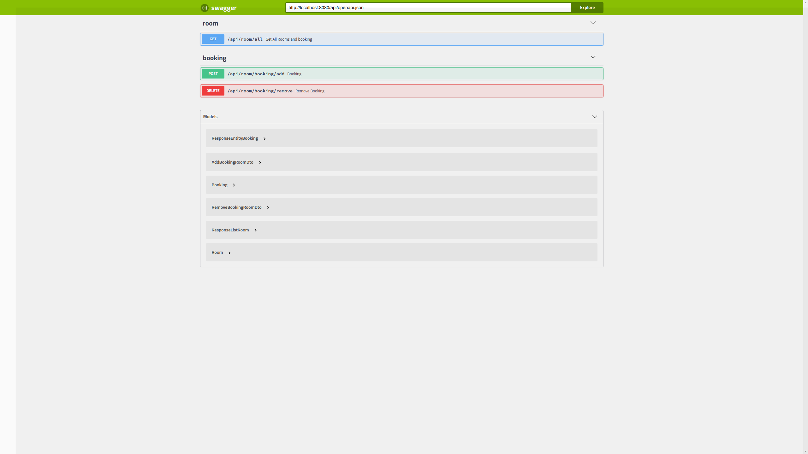
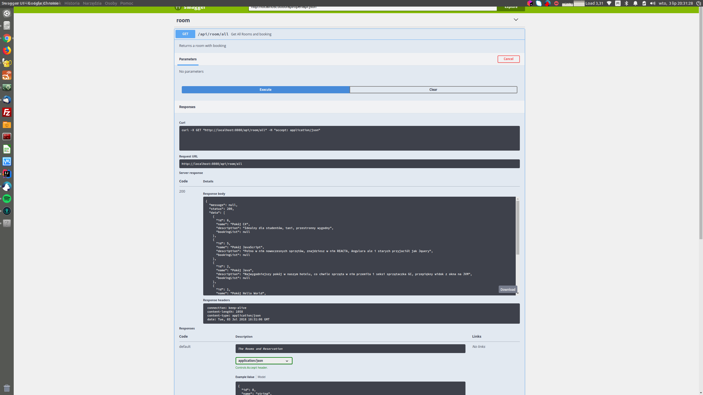

# light-booking
Aplikacja pokazowa do rezerwacji pokoi w hotelu, wraz z wysyłką powiadomień drogą mailową.


### Technologie
- Java 8
- Java EE
- MVN
- RestEasy
- Guava
- Git
- Wildfly
- Guava Cache
- Swagger (klient)

### Krótki Opis
Do przetrzymywania informacji o pokojach i rezerwacjach wykorzystywana jest Guava Cache.
Powiadomienia o przypomnieniu wysyłane są drogą meilową.
Klient do przetestowania aplikacji to Swagger UI.

### Instalacja

Light Booking wymagania:
- System Operacyjny zalecany Linux
- Java 8
- Wildfly 13
- MVN


Instrukcja przygotowana jest pod systemem Linux, aby odpalić aplikację pod Windows należy dostosować komendy pod bash, lub odpalać .bat


**Instalacja/Uruchomienie Wildfly 13**

Pobierz Wildfly 13 Final z:
http://wildfly.org/downloads/

Rozpakuj do folderu: wildfly-13


Uruchom serwer
```sh
cd wildfly-13/bin
./standalone.sh -c standalone-full.xml
```

Dodaj użytkownika do serwera wildfly:
```sh
cd wildfly-13/bin
./add-user.sh

Typ użytkownika: a) Management User
Username: light-booking
Password: q1w2e3r4
Groups: none
```

Dodaj serwer pocztowy do serwera wildfly

Skrzynka pocztowa utworzona została na serwerze Gmail, możesz z niej korzystać na potrzeby testów.
```sh
cd wildfly-13/bin
./jboss-cli.sh


Wykonaj w CLI te 3 polecenia (CTRL+C -> CTRL+V -> Enter)

/socket-binding-group=standard-sockets/remote-destination-outbound-socket-binding=mail-smtp-gmail:add(host=smtp.gmail.com, port=465)

/subsystem=mail/mail-session=LightBooking:add(jndi-name=java:jboss/mail/LightBooking)

/subsystem=mail/mail-session=LightBooking/server=smtp:add(outbound-socket-binding-ref=mail-smtp-gmail, username=light.booking.serwer, password=LightBooking2018, ssl=true)

```


Zamknij i uruchom serwer ponownie.
```sh
cd wildfly-13/bin
./standalone.sh -c standalone-full.xml
```


Super skonfigurowałeś poprawnie serwer.


### Budowanie i Deploy projektu
W projekcie pod system linux przygotowano skrypt budujący i wgrywający projekt na uruchomionego wildfly z konfiguracją podaną wyżej.

Uruchomienie skryptu:
```sh
./deploy.sh 
```
Skrypt ten buduje projekt i wgrywa na serwer.


Jeżeli nie chcesz używać skryptu deploy.sh użyj to:
```sh
mvn clean install
mvn wildfly:deploy-only -Dwildfly.hostname=localhost -Dwildfly.password=q1w2e3r4 -Dwildfly.username=light-booking -Dwildfly.port=9990
```

Super poprawnie zainstalowałeś aplikacje na serwerze.


#### Adres aplikacji:
#### http://localhost:8080/


### Klient

Do przetestowania projektu i dokumentacji endpoint'ów Rest użyłem SWAGGER'a

https://swagger.io/tools/swagger-ui/


Swagger UI znajduje się pod adresem:

http://localhost:8080/


### Zrzut z Klienta



Aby przetestować pobieranie wszystkich pokoi, kliknij: "Get All Rooms and booking"

Kolejno przycisk Try it Out, a następnie Execute.



